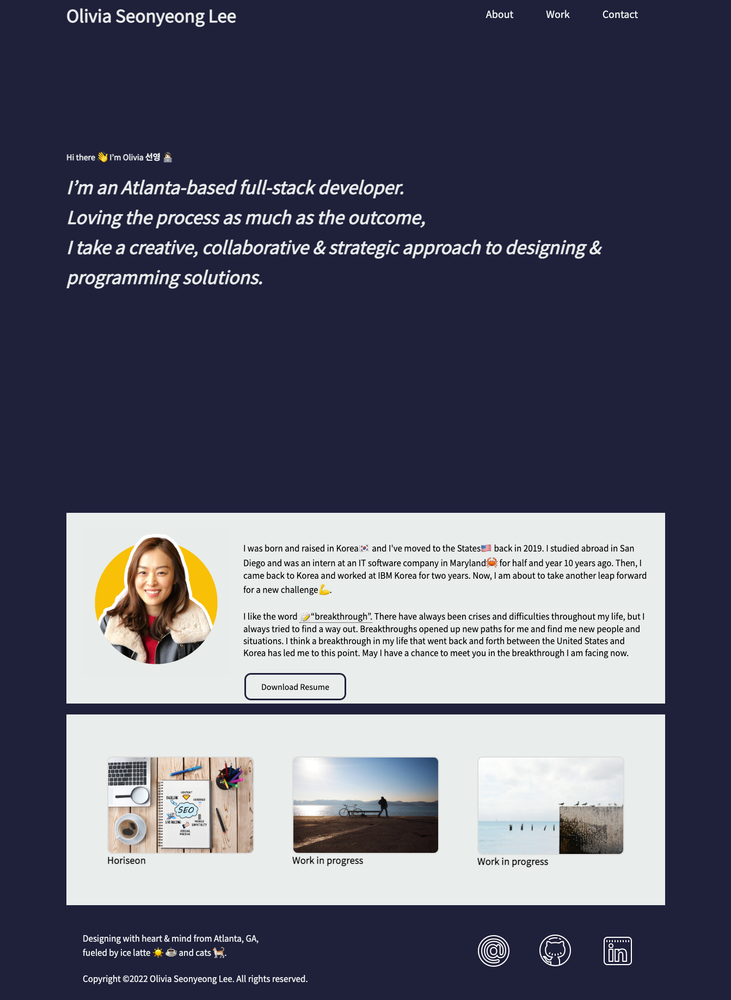

# Portfolio

## Description

I created my very first portfolio web application which consists of three sections on a single page: about me, my works, and contact. 

- About: You can see a short description of me including my profile picutre and download the Resume file.
- Work: I added a refactored project last week, the rest will be added later.
- Contact: I put a link on the contact so you can email me or you can reach out to me via the social media icon in the footer.

## Usage
Live application deployed at: https://oliviasylee.github.io/portfolio/   

## Features
- About: You can see a short description of me including my profile picutre and download the Resume file.
- Work: I added a refactored project last week, the rest will be added later.
- Contact: I put a link on the contact so you can email me or you can reach out to me via the social media icon in the footer.

## Contributing
Olivia Seonyeong Lee

## Questions
If you have any questions about this projects, please contact me at oliviasylee@gmail.com. You can view more of my projects at https://github.com/oliviasylee.
